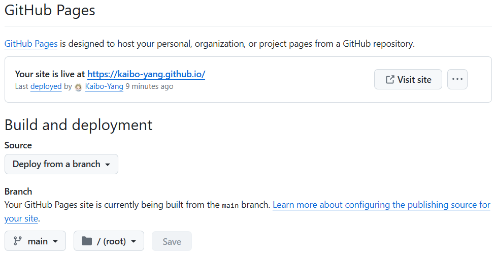

# kaibo-yang.github.io

杨凯博的个人主页

## 网页搭建过程

1. 在Github中创建仓库，仓库命名为`username.github.io`，`username`可替换，最好为Github账号名称，最好为小写

- 仓库设置为公开
- 在仓库的**Settings/Pages**选项中，设置Branch为main/(root)

2. 在本地中使用`git clone`下载，并在文件夹中添加文件`index.html`（网站将从`index.html`进入）
3. 在`index.html`中按照HTML语言编写网站内容，详细查看[HTML基础内容](./files/HTML)
4. 使用git操作上传文件，随后可看到网址内容更新

## 架构说明

如果在github中设置/docs文件夹，则后续的所有文件应以该文件夹为根目录

本文档中设置为/root文件夹

### /css

样式文件夹，存放网页中所使用的各种样式

### /files

存放文件

### /imags

图片文件夹，存放网页中所使用的图片

#### /base

存放网页的一些基础元素

#### /README.assets

存放README.md中的一些图片文件

## ~~！废弃建立过程（使用jeykll）~~

1. 安装Ruby

- [Windows环境下安装Ruby教程-CSDN博客](https://blog.csdn.net/Alive_tree/article/details/103043158)
- 当前版本 [Ruby+Devkit 3.3.4-1 (x86)](https://github.com/oneclick/rubyinstaller2/releases/download/RubyInstaller-3.3.4-1/rubyinstaller-devkit-3.3.4-1-x86.exe)
- 安装验证：命令行输入`ruby -v`，出现版本号即为成功

2. 安装Jekyll

- [如何使用Jekyll在GitHub Pages上搭建网站](https://blog.csdn.net/qq_33919450/article/details/127859193)
- 安装命令`gem install jekyll bundler`
- 安装验证：`jekyll -v`

3. Github创建仓库，命名为`username.github.io`，`username`可替换，不区分大小写

4. 设置Github

- [如何使用Jekyll在GitHub Pages上搭建网站](https://blog.csdn.net/qq_33919450/article/details/127859193)
- 创建`_config.yml`，设置`/doc`文件夹，更多内容查看[Jeykll官方文档](https://jekyllrb.com/docs/configuration/options/)

5. 简单工作流程

- 创建/修改index.html文件
- 生成静态网站`jekyll build`
- 本地演示`jekyll serve`